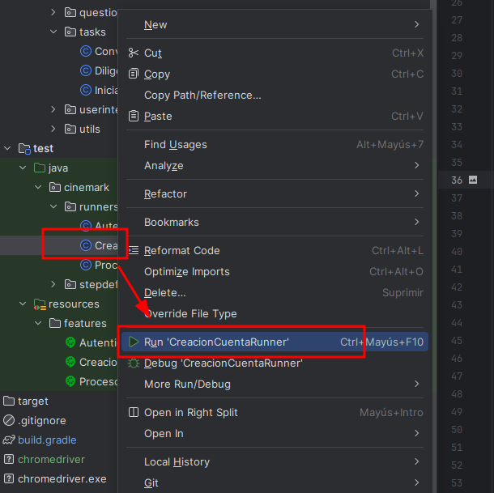

# test-API-reqres

Proyecto de automatización con [Serenity BDD](https://serenity-bdd.github.io/docs/guide/user_guide_intro), Screenplay como patrón de diseño, Cucumber para el diseño de escenarios de 
prueba, Java como lenguaje y Serenity Rest para probar la API del sitio [REQRES](https://reqres.in)


---  

Requisito para ejecutar **[JDK 11.0.11](https://www.oracle.com/co/java/technologies/javase-jdk11-downloads.html)**
y  **[gradle 5.2.1](https://gradle.org/install/)** o superior.

#### Ejemplo comando de ejecución:

Para ejecutar un runner específico:
```   gradlew clean test -Prunner="ObtenerUsuariosRunner" aggregate --info ``` en Ubuntu como es mi caso ```./gradlew clean test...```

Para ejecutar toda la batería de pruebas:
```   gradlew clean test  aggregate  ```
---  
## Ejecución de pruebas

Para ejecutar por medio del IDE basta con dar click derecho sobre cada runner y hacer click sobre Run (nombre del archivo)
como se muestra en la imagen a continuación


---
Para ejecutar la batería completa de pruebas se puede utilizar el siguiente comando en consola:
``` gradlew test ```  en Ubuntu como es mi caso ```./gradlew test```
